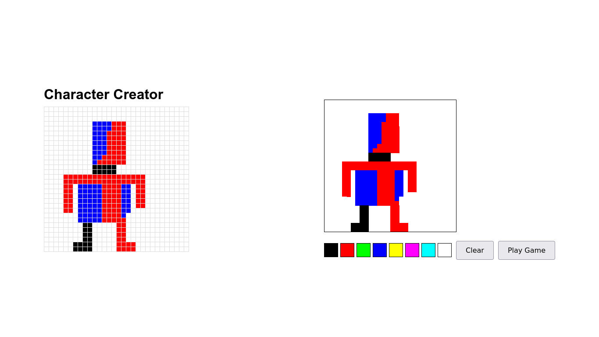
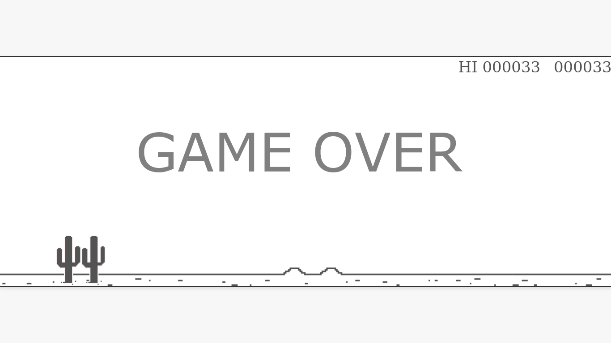

# Pixel Runner

Pixel Runner is a 2D endless runner game where the player controls a character that must avoid obstacles and collect coins to achieve the highest score possible.

## Table of Contents

- [Installation](#installation)
- [Gameplay](#gameplay)
- [Controls](#controls)
- [Contributing](#contributing)
- [Technologies Used](#technologies-used)
- [How to Play](#how-to-play)
- [Screenshots](#screenshots)

## Installation

1. Clone the repository:
   ```sh
   git clone https://github.com/fitiha/Pixel-Runner.git
   ```
2. Navigate to the project directory:
   ```sh
   cd Pixel-Runner
   ```
3. Open `index.html` in your web browser.

## Gameplay

In Pixel Runner, you control a character that runs automatically. Your goal is to avoid obstacles score. The game gets progressively harder as you advance.

## Controls

- **Spacebar**: Jump

## Contributing

Contributions are welcome! Please fork the repository and create a pull request with your changes. Make sure to follow the coding standards and write tests for new features.

## Technologies Used

- HTML5
- CSS3
- JavaScript (ES6)
- Canvas API

## How to Play

1. Open `index.html` in your web browser.
2. Use the character creator to design your character.
3. Click the "Play Game" button to start the game.
4. Avoid obstacles and try to achieve the highest score possible.

## Screenshots



